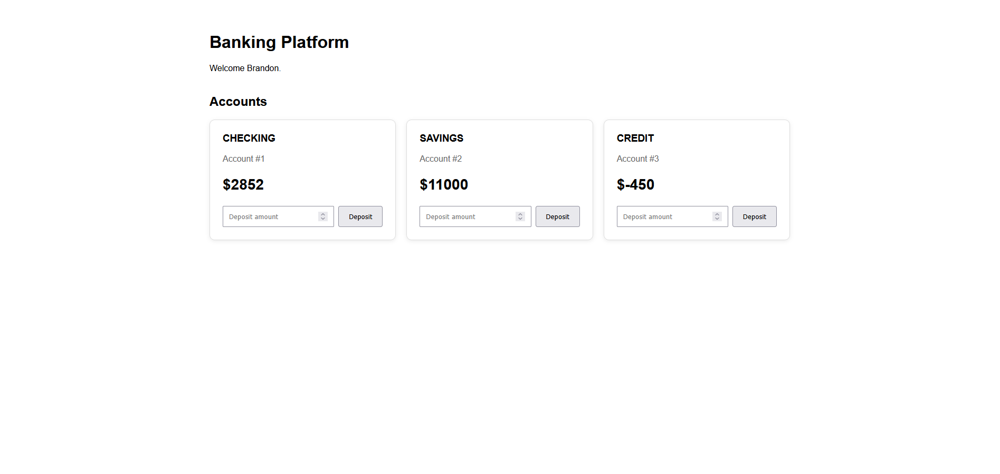

## Running Locally

### Run the Backend

From the project root:

```powershell
.\mvnw.cmd spring-boot:run
```

The API runs at `http://localhost:8080`.

### Run the Angular Frontend

From the `frontend` directory:

```bash
npm ci
npm start
```

The frontend runs at `http://localhost:4200`.

### Run with Docker

Create a local `.env` file in the project root containing the required environment variables.

Build and start the application:

```bash
docker compose up --build
```

Stop the application:

```bash
docker compose down
```

## Testing

Backend tests use JUnit 5 and Mockito for service-level testing. H2 is used as an in-memory database for automated tests so the test suite does not require a local SQL Server instance.

Run the backend test suite from the project root:

```powershell
.\mvnw.cmd test
```

## Continuous Integration

GitHub Actions automatically validates the application on pushes and pull requests to `master`.

The CI pipeline:

- Sets up Java 21 and runs the Maven test suite
- Sets up Node.js and installs frontend dependencies
- Builds the Angular frontend
- Fails the workflow if the backend tests or frontend build fail

## Security

The project uses Spring Security with HTTP Basic authentication for demonstration purposes.

Authentication credentials and database credentials can be configured through environment variables. Local `.env` files and database passwords are excluded from source control.

For a production application, the demo Basic Authentication implementation would be replaced with a more appropriate authentication flow and HTTPS would be required.

## Dashboard

